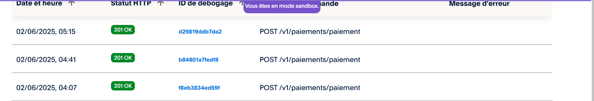
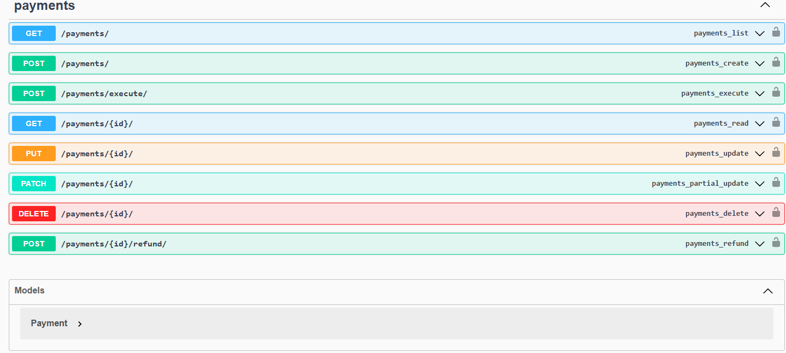

# Django PayPal Payment API

A robust Django REST API for handling PayPal payments with comprehensive error handling, logging, and proper separation of concerns.

## 🌟 Features

- Complete PayPal payment integration
- RESTful API endpoints
- Comprehensive error handling
- Detailed logging system
- Database tracking of payment status
- Support for payment execution and refunds
- Clean architecture with separation of concerns

## 🛠 Technology Stack

- Python 3.8+
- Django 4.2+
- Django REST Framework
- PayPal REST SDK
- PostgreSQL (recommended) / SQLite

## 📋 Prerequisites

Before you begin, ensure you have:

- Python 3.8 or higher installed
- A PayPal Developer account
- PayPal API credentials (Client ID and Secret)
- PostgreSQL (recommended) or SQLite

## ⚙️ Installation

1. Clone the repository:
```bash
git clone https://github.com/pemochamdev/PayPal-Payment-using-django.git
cd PayPal-Payment-using-django
```

2. Create and activate a virtual environment:
```bash
python -m venv env
source env/bin/activate  # On Windows: env\Scripts\activate
```

3. Install dependencies:
```bash
pip install -r requirements.txt
```

4. Create environment variables file (.env):
```env
DJANGO_SECRET_KEY=your_secret_key
PAYPAL_CLIENT_ID=your_paypal_client_id
PAYPAL_CLIENT_SECRET=your_paypal_client_secret
PAYPAL_MODE=sandbox  # or 'live' for production
```

5. Run migrations:
```bash
python manage.py makemigrations
python manage.py migrate
```

## 🚀 Usage

### Starting the Server

```bash
python manage.py runserver
```

### API Endpoints

#### Create Payment
```bash
POST /api/payments/
```
Request body:
```json
{
    "amount": 10.00,
    "description": "Payment description"
}
```
Response:
```json
{
    "id": "uuid",
    "paypal_payment_id": "PAYID-...",
    "approval_url": "https://www.sandbox.paypal.com/..."
}
```

#### Execute Payment
```bash
POST /api/payments/execute/
```
Request body:
```json
{
    "paymentId": "PAYID-...",
    "PayerID": "BUYER-ID"
}
```

#### Get Payment Details
```bash
GET /api/payments/{payment_id}/
```

#### Request Refund
```bash
POST /api/payments/{payment_id}/refund/
```
Request body:
```json
{
    "amount": 10.00,
    "reason": "Customer request"
}
```

## 📁 Project Structure

```
paypal-payment-using-django/
    -config(project name)
    -payments(app)
    -requirements.txt
    -READMED.md
```

## 💡 Implementation Details

### Models

The project uses two main models:

1. `Payment`: Tracks payment information and status
2. `PaymentRefund`: Handles refund information

### Service Layer

The `PayPalService` class handles all PayPal-related operations:
- Payment creation
- Payment execution
- Refund processing
- Error handling
- Logging

### Error Handling

Custom exceptions for different scenarios:
- `PaymentError`: Base payment exception
- `PaymentValidationError`: For validation issues
- `PaymentProcessError`: For processing errors
- `RefundError`: For refund-related issues

## 🔒 Security Considerations

- All sensitive credentials are stored in environment variables
- Input validation for all API endpoints
- CSRF protection enabled
- Proper error handling to prevent information leakage
- Logging of sensitive data is sanitized

## 📝 Logging

The application implements comprehensive logging:
- Payment creation attempts
- Execution status
- Error tracking
- PayPal API responses
- Database operations

## 🌐 Environment Configuration

### Development
```python
PAYPAL_MODE = "sandbox"
DEBUG = True
```

### Production
```python
PAYPAL_MODE = "live"
DEBUG = False
```

## 🔧 Testing

Run the test suite:
```bash
python manage.py test
```

## 🤝 Contributing

1. Fork the repository
2. Create a feature branch
3. Commit your changes
4. Push to the branch
5. Create a Pull Request

## 📄 License

This project is licensed under the MIT License - see the LICENSE file for details.

## 👥 Author

Your Name
- GitHub: [@pemochamdev](https://github.com/pemochamdev)
- LinkedIn: [pempeme mohamed chamsoudine](https://www.linkedin.com/in/mohamed-chamsoudine-pempeme-513847201/)

## 🙏 Acknowledgments

- PayPal Developer Documentation
- Django Documentation
- Django REST Framework Documentation

## 📞 Support

For support, email your.pemochamdev@gmail.com or open an issue on GitHub.



